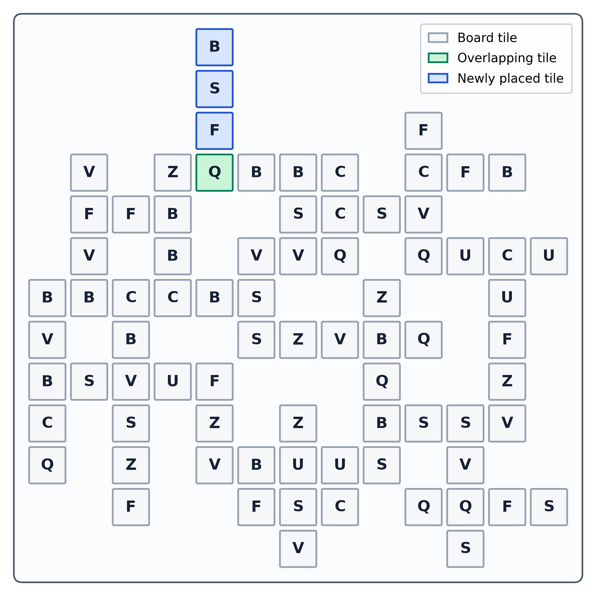
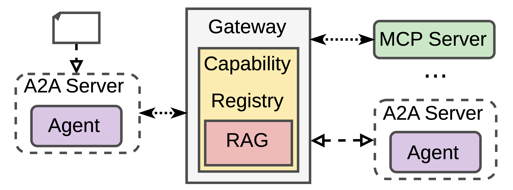
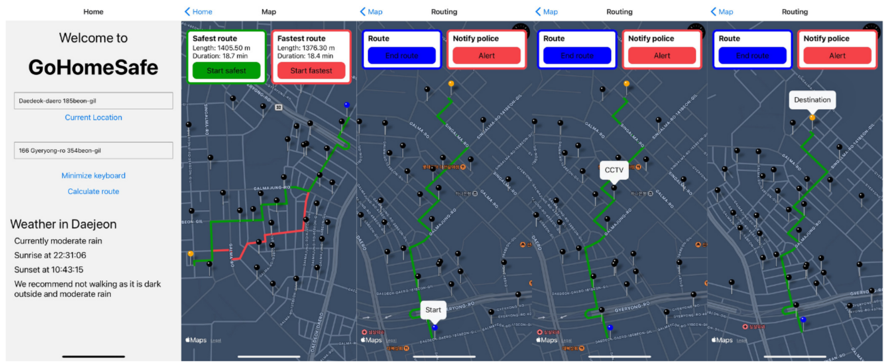

## Hi, I'm Max 👋

Cloud-native backend developer who has drifted deep into **AI engineering**: these days I mostly build LLM-powered features, RAG pipelines and agents on top of real backend systems, and take them past the prototype stage into production: reliable, grounded and governed.

Alongside work I'm doing my Computer Science Master's at **TUM**, where my recent projects focus on **multi-agent systems** and **evaluating LLM reasoning**.

I like solid backend foundations, clean abstractions, and trying out new tech as soon as it lands.

## Featured Projects 🚀

### 🧩 [Frabble: A Spatial Reasoning Benchmark for LLMs](https://github.com/maximilian-armuss-dev/frabble)
*TUM research project with [@maximilian-armuss-dev](https://github.com/maximilian-armuss-dev) · 2026*

**Why:** reasoning benchmarks for LLMs are often undermined by **data contamination**, natural-language recall shortcuts, saturation and LLM-as-judge scoring.

**Our approach:** a Scrabble-style game over **freshly sampled formal grammars** instead of a dictionary. The alphabet, grammar and board are resampled per case, which minimizes contamination by construction. The model makes one high-scoring move, and code checks it deterministically.

**Includes**
- seeded grammar and puzzle generation
- deterministic validation and scoring
- evaluation of seven frontier models
- paper + result visualizations

 

---

### 🧠 [Capability Gateways for Multi-Agent Systems](https://github.com/huppertzmax/capability-gateway)
*TUM NLP practical course, team of four · 2025-2026*

**Why:** as multi-agent systems grow, agents often see capability descriptions, protocol formats and execution details all at once. They have to plan and handle execution in a single context, which grows with every new tool (**context bloat**).

**Our approach:** a **Capability Gateway** that puts tools (MCP) and peer agents (A2A) behind one capability layer and **stages** what the agent sees. The agent plans on semantic descriptions first and only gets execution details when it needs them. RAG keeps irrelevant capabilities out of the context.

**Result:** better task success, token efficiency and latency than direct protocol exposure. The more the environment grows, the more the RAG layer helps.

  

---

### 📐 [Bachelor's Thesis: Contrastive Learning vs. Spectral Decomposition](https://github.com/huppertzmax/bachelor-thesis-code)
*TUM · 2024-2025*

Several theories claim contrastive learning is closely related to spectral decomposition, but few have been tested in practice. I implemented three of these theories in PyTorch and introduced unsupervised metrics (CKA, ridge-regression alignment, distance measures) to compare the learned representations. It turns out the theories vary a lot in how well they hold up in practice.

## 🏆 Hackathons

[**hackaTUM**](https://hack.tum.de/) is the official hackathon of TUM's computer science department. It has run every year since 2016 and is one of the largest of its kind in the EU, with teams working on challenges set by industry partners.

- **[RiskFlow](https://github.com/huppertzmax/RiskFlow)**, 🥈 2nd place in the Siemens challenge, hackaTUM 2024 ([Devpost](https://devpost.com/software/riskflow))
  Vulnerability management: an LLM extracts structured data from CVE reports, and Neo4j graph queries then find affected systems and compute risk metrics such as internet reachability. *Next.js · Neo4j · OpenAI*
- **[ReFlow](https://github.com/huppertzmax/Hackatum-2022)**, 🥇 winner of the Sixt challenge, hackaTUM 2022 ([Devpost](https://devpost.com/software/reflow-a9z3r6))
  Schedules EV charging across wallboxes at rental stations, based on upcoming rentals and battery levels. *Spring Boot · MySQL · React*

## 🌏 Earlier Work

**[GoHomeSafe](https://github.com/huppertzmax/GoHomeSafe)** + **[mobile app](https://github.com/huppertzmax/GoHomeSafe_Mobile)**: a term project from my exchange semester at **KAIST** (South Korea) in 2023. It routes pedestrians in Daejeon along paths with as many CCTV cameras as possible, without making the trip much longer. *Flask · graph routing · React Native*

  

Hackathon and bachelor-era repos are kept as they were. They're not how I'd write code today, but they show the journey.
